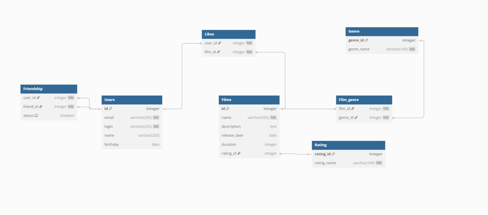

# java-filmorate

Template repository for Filmorate project.

### Список выполненных задач

1. Функциональность «Отзывы». 4 SP
2. Функциональность «Поиск». 3 SP
3. Функциональность «Общие фильмы». 1 SP
4. Функциональность «Рекомендации». 3 SP
5. Функциональность «Лента событий». 3 SP
6. Функциональность «Удаление фильмов и пользователей». 2 SP
7. Функциональность «Фильмы по режиссёрам». 4 SP
8. Функциональность «Популярные фильмы». 2 SP

DB scheme - /storage-scheme.jpg
